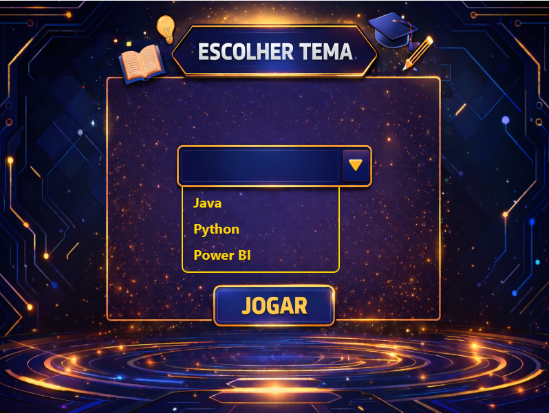
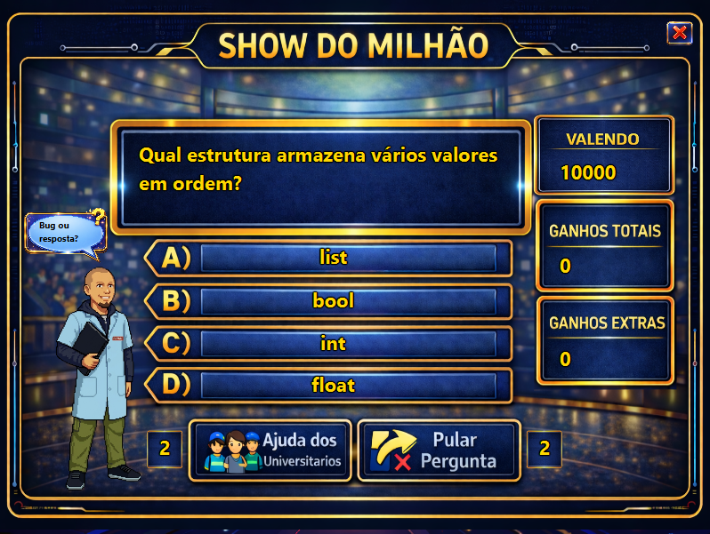
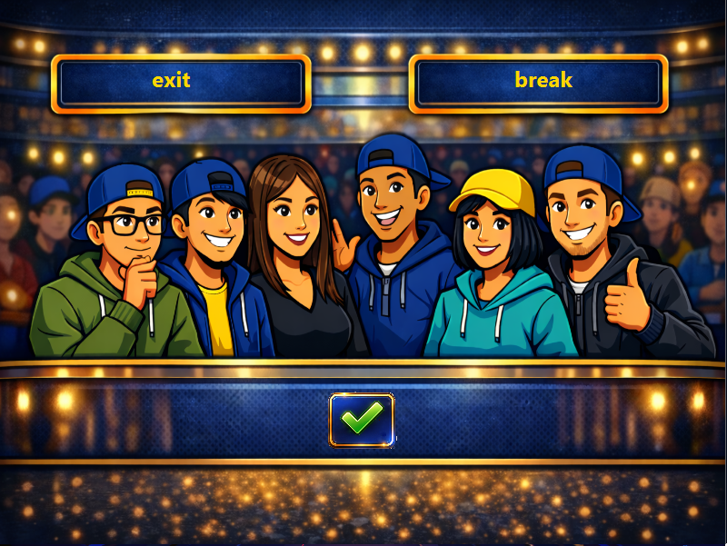

# 🎮 Show do Milhão Acadêmico

> Uma releitura do clássico **Show do Milhão**, desenvolvida em **Java** e **JavaFX** como projeto acadêmico no SENAI.

O jogo desafia o jogador com perguntas de múltipla escolha distribuídas em diferentes categorias, utilizando uma interface gráfica moderna, efeitos sonoros e mecânicas inspiradas no programa de televisão. Todo o projeto foi desenvolvido com foco em boas práticas de programação, organização do código e experiência do usuário.

---

## 🌟 O que torna este projeto diferente?

Ao invés de ser apenas um jogo de perguntas, este projeto foi pensado para simular a experiência de um game show.

- 🎯 Perguntas organizadas por categorias
- 🔊 Sons e músicas durante a partida
- 💡 Sistema de ajuda dos universitários
- 🎲 Escolha de temas antes de iniciar
- 📈 Progressão do jogador durante a partida
- 📁 Banco de perguntas externo em JSON
- 🖥️ Interface desenvolvida inteiramente em JavaFX

---

## 🖼️ Galeria

| Tela Inicial | Seleção de Tema |
|---------------|-----------------|
|  |  |

| Tela do Jogo | Ajuda |
|---------------|--------|
|  |  |

| Vitória |
|----------|
|  |

---

## ⚙️ Stack utilizada

- Java 17
- JavaFX
- Maven
- FXML
- CSS
- JSON

---

## 📦 Organização

```
src
 ├── controller
 ├── model
 ├── service
 ├── util
 ├── resources
 │    ├── audio
 │    ├── css
 │    ├── perguntas
 │    └── view
 └── Main.java
```

---

## 🚀 Executando

Clone o projeto

```bash
git clone https://github.com/Renan-De-Paula/Show_Do_Milhao_Academico.git
```

Entre na pasta

```bash
cd Show_Do_Milhao_Academico
```

Execute

**Windows**

```bash
mvnw.cmd javafx:run
```

**Linux / macOS**

```bash
./mvnw javafx:run
```

---

## 📚 Conceitos aplicados

Durante o desenvolvimento foram explorados diversos conceitos importantes, como:

- Programação Orientada a Objetos
- Arquitetura MVC
- Componentização com JavaFX
- Manipulação de arquivos JSON
- Navegação entre telas (FXML)
- Reprodução de áudio
- Organização de projetos Maven

---

## 💡 Próximas funcionalidades

- Ranking de jogadores
- Cronômetro por pergunta
- Multiplayer local
- Sistema de login
- Persistência de progresso
- Mais categorias
- Banco de dados

---

## 👥 Equipe

Este projeto foi desenvolvido como trabalho acadêmico no **SENAI**, unindo conhecimentos de programação, design de interface e desenvolvimento de jogos em Java.

### Desenvolvedores

- 👨‍💻 Gabriel Moura
- 👨‍💻 Renan De Paula
- 👨‍💻 Guilherme Pereira
- 👨‍💻 Vinicius Sanchez

### 👨‍🏫 Orientação

Agradecimento especial ao **Professor Leonardo Gabriel**, que inspirou diversas mecânicas do jogo e acompanhou o desenvolvimento do projeto.

---

## ❤️ Agradecimentos

Gostaríamos de agradecer ao **SENAI** e ao **Professor Leonardo Gabriel** pelo apoio, incentivo e ensinamentos que contribuíram para o desenvolvimento deste projeto.

Este trabalho representa não apenas a construção de um jogo em Java, mas também a aplicação prática de conceitos de Programação Orientada a Objetos, JavaFX, arquitetura MVC e desenvolvimento colaborativo.

---

## ⭐ Gostou do projeto?

Se este projeto foi útil ou serviu de inspiração, deixe uma ⭐ no repositório.
